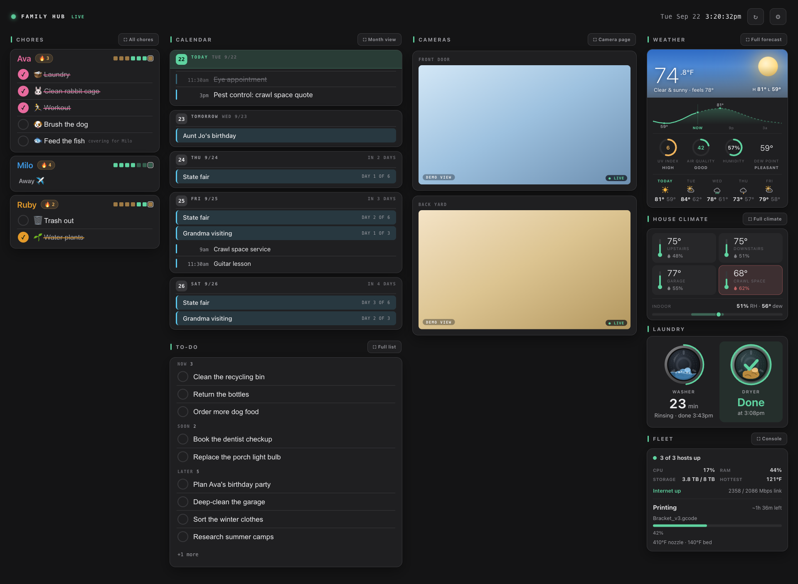
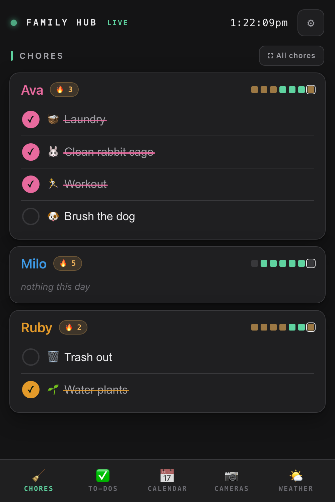

# family-hub

A self-hosted **family wall display** built for a touchscreen on the kitchen
wall, with the same page mobile-optimized for phones. Google Calendar and
Apple/ICS calendars front and center, a per-person daily chore tracker with
one-tap check-off, live security-camera tiles (UniFi Protect, Wyze, anything
go2rtc speaks), and at-a-glance weather and per-room climate cards that
expand to your full dashboards on a tap, all in a light or dark theme with
an accent color you pick.



*The kitchen wall: one card system across chores, the shared calendar with to-dos, cameras, and at-a-glance weather + per-room climate. Shown in the default grey theme with a green accent and sample data.*



*The same page, reflowed to five phone tabs, carrying the same theme. The Chores tab is shown here.*

Runs on any always-on Linux box with Docker. No cloud, no accounts, no
telemetry — your LAN only. Point a wall screen (or any browser, or a phone)
at one URL.

## What it looks like

- **Wall (1920×1080):** chores | calendar + to-dos | cameras | weather +
  climate, all in one card system. **Five display modes** (light, soft, blue,
  grey, black) **with a pick-your-accent color** (cyan, violet, amber, or green)
  and an optional subtle column
  separation, set from the wall itself or any phone and remembered per device.
- **Phone / tablet (≤1000px):** the same page reflows to five bottom tabs —
  Chores / To-Dos / Calendar / Cameras / Weather.
- **Calendar:** next-5-days home feed, full-screen month grid + week agenda +
  day drill-in, tap-any-event detail cards, your own Google sidebar colors,
  multi-day events painted across their span, ended events struck through.
- **Chores:** per-person cards in each person's color, streaks (🔥), a 7-day
  week strip, deterministic rotations, a browsable day history, and a one-shot
  confetti celebration when someone clears their day.
- **To-Dos:** one shared household list for the stuff that isn't a scheduled
  chore — anyone adds, anyone checks off. Grouped Now / Soon / Later, items
  carry over until done, checked items linger struck-through until midnight,
  and a 30-day "recently done" list un-deletes mistakes.
- **Weather & climate:** a glanceable weather card (temperature, a forecast
  sparkline, UV index, air quality, humidity, dew point) and a per-room indoor
  climate card (temp + humidity, with a warn state when a room runs hot or a
  sensor goes stale). Tap **⛶ Full** on either to open your full weather or
  climate dashboard. Both fail soft: a dead feed quietly hides its card, never
  the wall.
- **Manage:** `/admin.html` from any browser: people, a bigger and brighter
  color palette, chores, schedules, rotations. No app to install.

## Architecture & trust model

**Dumb edge, smart box.** One FastAPI + SQLite container does everything; the
frontend is dependency-free vanilla JS baked into the image.

```
Wall / phones ─► http://<your-server>:8138/       family-hub (FastAPI + SQLite)
                          │ server-side sync/proxies
                          ├─► Google Calendar API   (read-only, polled every 5 min)
                          ├─► any ICS/webcal feeds  (iCloud, school, holidays…)
                          ├─► :1984 go2rtc          (camera tiles, optional)
                          └─► your own dashboards   (embedded panels, optional)
```

- **No auth, LAN-only — on purpose.** Anyone on your LAN can check off chores;
  that is the point of a family wall. Bind it to a LAN interface (`HUB_BIND`
  in `.env`) and never port-forward it. Away from home, reach it the way you'd
  reach any other LAN-only box: VPN into your home network first (WireGuard,
  Tailscale, or your router's built-in VPN all work), then open the same
  phone URL — that keeps the no-auth trust model intact instead of putting
  the hub on the open internet.
- **Fails soft.** The hub renders fine with zero cameras, zero panels, and no
  calendar configured; a dead upstream grays its tile with a quiet "offline";
  a dead calendar feed keeps showing its last-synced events.
- **Secrets never live in git.** OAuth tokens, camera URLs (Protect RTSPS
  URLs are per-camera capability tokens!), and Wyze credentials all live in
  the git-ignored `data/` directory on the box.
- **No microphones.** Every camera stream is video-only, enforced twice
  (`#media=video` on every go2rtc stream, `ENABLE_AUDIO=False` on the Wyze
  bridge). A family wall should never be a listening device.

## Quick start

```bash
git clone https://github.com/drench44/family-hub.git && cd family-hub
cp config.example.json config.json     # edit: your calendars/cameras/panels
cp .env.example .env                   # edit: your server's LAN IP + timezone
mkdir -p data && chmod 700 data
docker compose up -d --build web       # just the hub; cameras come later
curl -s http://<your-server>:8138/health   # {"status":"ok"}
```

Open `http://<your-server>:8138/admin.html`, add your people and chores, and
the wall at `http://<your-server>:8138/` comes alive. Everything below is
optional and independent — add the pieces you have.

> The frontend is **baked into the image**: after changing anything under
> `src/family_hub/web/static`, `docker compose build web` — a bare restart
> keeps the old files.

## Try the demo

Want to see the whole wall before wiring up anything? Run it with `DEMO=1` and
it comes up as a fully populated sample: a fake family (Ava, Milo, Ruby) with
chores, streaks and a week strip, a shared to-do list, a few calendar events,
canned weather and per-room climate cards, and placeholder camera tiles. No
config, no calendars, no cameras, no feeds needed. Nothing reaches the network.

```bash
DEMO=1 DB_PATH="$(mktemp -d)/demo.db" CONFIG_PATH=config.demo.json \
  PYTHONPATH=src DISABLE_SYNC=1 \
  python3 -m uvicorn family_hub.app:app --port 8139
```

Then open `http://localhost:8139/`. Everything is fake sample data seeded on
first launch, so it's safe to poke at. (`docker compose` users can pass the
same `DEMO=1` in the `web` service's environment.)

## Put it on a wall (Raspberry Pi kiosk)

To mount the wall on a touchscreen, a Raspberry Pi makes a tidy appliance:
it boots straight into the dashboard, fullscreen, no browser chrome, no
cursor, and never sleeps. See **[docs/raspberry-pi-kiosk.md](docs/raspberry-pi-kiosk.md)**
for the full walkthrough, with copy-paste files in [`docs/kiosk/`](docs/kiosk/).

## config.json reference

| Key | What it is |
|---|---|
| `port` | Hub port (default 8138) |
| `calendars` | Calendar sources, in display order (see below) |
| `calendar_window_days` / `calendar_past_days` | Sync window forward / back |
| `cameras` | go2rtc streams shown as tiles: `{"src","label"}` + optional `"hd"` (higher-res twin used full-screen) |
| `camera_page` | The phone/tablet **Cameras** tab as a 2×2 (row-major) live grid — same entry shape as `cameras`, but its own set and order, so the tab can show cameras the wall column doesn't. Omit to reuse `cameras`. |
| `panels` | Always-on dashboard embeds (see below) |
| `go2rtc_base` | Your go2rtc URL (browser-reachable), omit if no cameras |
| `weather_base` | Base URL of a weather JSON feed for the native weather card (the card shows for a configured `weather` panel; empty base = "unavailable" note) |
| `climate_base` | Base URL of a per-room climate JSON feed for the native climate card (shows for a configured `climate` panel; empty base = "unavailable" note) |
| `theme` | House default display theme — `{"mode","accent","columns"}` (`mode`: light/dark, `accent`: cyan/violet/amber/green, `columns`: none/wells/lines). Applied on a fresh device with no saved override |

### Calendars: Google

Each entry: `{"id": "you@gmail.com", "label": "You", "color": "#5BC9F0"}`.
The `id` is the calendar's ID from Google Calendar settings (your address for
your primary calendar). One-time auth, from any desktop:

1. In the [Google Cloud console](https://console.cloud.google.com): create a
   project → enable the **Google Calendar API** → configure the OAuth consent
   screen (External) → **publish the app to Production** (otherwise tokens
   expire every 7 days) → create an OAuth client of type **Desktop app** and
   download its JSON as `scripts/client_secret.json`.
2. `cd scripts && python3 google-auth.py` (needs
   `pip install google-auth-oauthlib`). Approve read-only access; it writes
   `token.json`.
3. Copy `token.json` into the box's `data/` directory. Done — the next 5-min
   sync picks it up. Your own sidebar colors and per-event colors carry over.

### Calendars: Apple / iCloud / any ICS feed

Add `"kind": "ics"` and a `"url"` — no auth needed:

```json
{ "id": "school", "label": "School", "color": "#C39BEA",
  "kind": "ics", "url": "webcal://p123-caldav.icloud.com/published/2/…" }
```

For iCloud: Calendar app → right-click a calendar → Sharing → **Public
Calendar**, copy the `webcal://` link. Works equally for school calendars,
sports team feeds, national holidays — anything that publishes ICS.
Recurring events are fully expanded. A feed that goes dark keeps its
last-synced events on the wall instead of vanishing.

### Panels: embed any dashboard you already run

Each panel renders a live page at a fixed virtual viewport and scales it to
fit its slot — so a dashboard designed for a big screen reads perfectly in a
column. Optionally crop to just the part you want:

```json
{ "id": "weather", "label": "Weather", "url": "http://192.168.1.50:8137/",
  "vw": 1024, "vh": 600, "full": "fit" }
```

| Field | Meaning |
|---|---|
| `vw`, `vh` | The visible region's design size (px) |
| `page_w` | Lay the page out wider than the visible region (for cropping) |
| `crop_top`, `crop_left` | Pan the visible region to a specific card |
| `full` | Full-screen mode: `"native"` (default; embeds the page raw) or `"fit"` (scales a fixed `vw`×`vh` sheet to fill the screen — for kiosk-style pages) |
| `full_url` | Different URL for full-screen (defaults to `url`) |

### Cameras

Camera tiles are live sub-second WebRTC streams via
[go2rtc](https://github.com/AlexxIT/go2rtc):

1. `cp go2rtc.yaml.example data/go2rtc.yaml` and fill in your streams —
   the example covers UniFi Protect (including the `rtspx://` fallback) and
   Wyze. Set `webrtc.candidates` to your server's LAN IP.
2. `docker compose up -d go2rtc`
3. Add each stream to `cameras` in config.json.

On phones and tablets the **Cameras** tab shows a 2×2 live grid instead of the
wall's stacked column. It defaults to your `cameras`; set `camera_page` to give
that grid its own set and order (top-left, top-right, bottom-left, bottom-right)
— handy for surfacing a camera there that isn't on the wall.

> **Slow first picture? Check the camera's keyframe interval.** An H.264
> viewer can only start decoding at a keyframe, and go2rtc passes streams
> through without transcoding — so every viewer that joins an
> already-running stream (the wall keeps tile streams running 24/7) waits
> up to one full keyframe interval showing black. UniFi Protect defaults
> every channel to a **5-second** interval (`idrInterval: 5`), which reads
> as "the cameras take forever to load." Protect's UI doesn't expose the
> setting, but its API does — drop the interval to 1s on the channel your
> tile embeds (the Medium channel here, which is not the recording stream,
> so recorded footage and storage are untouched):
>
> ```bash
> # cookie login; the x-csrf-token RESPONSE header authorizes the PATCH
> curl -sk -c /tmp/uos -D /tmp/hdrs -H 'Content-Type: application/json' \
>   -d '{"username":"USER","password":"PASS"}' https://CONSOLE/api/auth/login
> CSRF=$(grep -i '^x-csrf-token:' /tmp/hdrs | tr -d '\r' | cut -d' ' -f2)
> # camera ids: GET https://CONSOLE/proxy/protect/api/cameras
> curl -sk -b /tmp/uos -X PATCH -H 'Content-Type: application/json' \
>   -H "X-CSRF-Token: $CSRF" \
>   -d '{"channels":[{"id":1,"idrInterval":1}]}' \
>   https://CONSOLE/proxy/protect/api/cameras/CAMERA_ID
> ```
>
> The camera applies it live (no reboot). Wyze firmware keyframes every 2s
> with no exposed setting to change it — that's the floor for Wyze tiles.

**Wyze** cams have no native RTSP — the bundled `wyze-bridge` service bridges
them: put your Wyze email/password/API-key in `data/wyze.env`
(`WYZE_EMAIL=…`, `WYZE_PASSWORD=…`, `API_ID=…`, `API_KEY=…`; get an API key at
developer-api-console.wyze.com), `docker compose up -d wyze-bridge`, find each
camera's slug in the bridge WebUI on `:5050`, and reference it from
`go2rtc.yaml`. Remove the service from the compose file if you don't need it.

> **Wyze Cam v3/v4 on recent firmware (the IOTC_ER_TIMEOUT problem):** Wyze's
> 2025 firmware (v4 4.52.9+) disabled the local TUTK P2P protocol, so the
> once-standard `mrlt8/wyze-bridge` can no longer connect to these cameras —
> streams fail with `IOTC_ER_TIMEOUT` even though the Wyze app still plays
> them. The compose here uses the actively-maintained **IDisposable fork**,
> which auto-falls-back to Wyze's WebRTC backend (the path that still works),
> so these cameras stream again with no downgrade. Two gotchas: this fork
> slugs stream names with **underscores** (not the original's dashes) — copy
> the exact slug from the `:5050` WebUI — and WebRTC streams are **on-demand**
> (they connect when a viewer opens the tile). If one specific camera fails
> its WebRTC handshake while its neighbors work, it's usually that camera's
> cloud session — a full power-cycle (unplug 30s) or remove/re-add in the
> Wyze app clears it.

A camera that's offline shows an honest gray "offline" tile — the hub probes
each stream every 30s and never fakes a LIVE badge.

> **Blurry full-screen?** A camera full-screens the *same* stream its tile
> uses — there's no magic upscaler — so a tile-resolution stream stretched to
> fill the wall looks soft. Give the camera a distinct higher-res twin: add a
> second go2rtc stream (`porch_hd`, `wyze_hd`) pointing at the camera's main /
> 4K channel and reference it as `"hd"` in that camera's `config.json` entry.
> The tile stays on the light stream; full-screen cross-fades up to the twin
> once it's live. One ceiling to know: a **Wyze v4 on recent firmware** runs
> the bridge's WebRTC fallback, and Wyze's cloud WebRTC path is capped at SD —
> for those cameras the main stream is already the sharpest source, so a twin
> won't help. Older Wyze models and UniFi Protect cams expose a real full-res
> channel that does.

## The chores model

**People** are nicknames with a color — the one expressive hue on the wall.
**A chore** has a schedule (`daily`, or specific weekdays) and an assignment
(`fixed` to one person, or a `rotation`: an ordered list of people, repeats
allowed, assigned deterministically — `rotation_order[n mod len]` over the
chore's occurrence count, so there is no stored "whose turn" state to drift).
Rotations skip deactivated people — their turns fall to the remaining members.
Completion is one tap; past days are read-only. **History is frozen:** each
served day's plan is recorded (the `occurrence_log` table), and past days
render from that record — so editing a schedule, reshuffling a rotation,
deactivating, or even deleting a chore changes today and the future only.
Nobody's streak is rewritten by an edit, and a deleted chore still shows on
the days it was actually done. Streaks count consecutive completed days (rest
days skip, an unfinished today is forgiven). It's all managed from
`/admin.html`.

## Backup

The SQLite DB (`data/hub.db`) is the only state that originates here —
everything else re-syncs. `backup/` contains a WAL-safe nightly snapshot
script + systemd units (fail-loud, atomic, keeps 14): edit the paths in the
`.service` file, then install script + units and
`systemctl enable --now family-hub-backup.timer`.
**Restore:** stop the container, copy a snapshot over `data/hub.db`, start.

## Tests

Four layers, no external services needed:

```bash
pip install pytest fastapi httpx uvicorn icalendar recurring-ical-events \
  google-api-python-client google-auth google-auth-oauthlib tzdata
PYTHONPATH=src python3 -m pytest tests -q
```

Pure chore logic (rotation/streak math) · API (FastAPI + temp SQLite, all
upstreams mocked) · static frontend contracts (every referenced class styled,
no external resources, no hardcoded URLs) · executable JS helpers
(`node --test`, needs Node ≥ 20).

## License

MIT.
